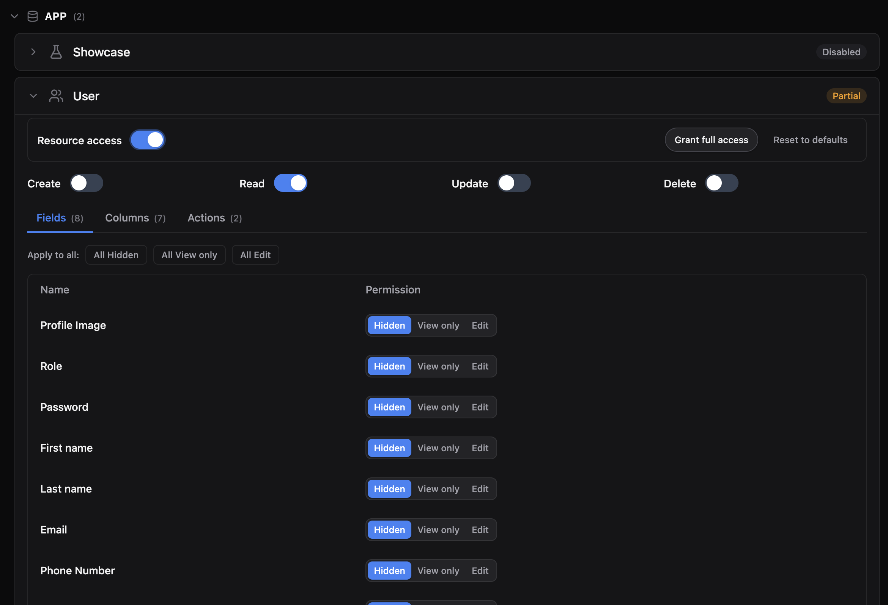
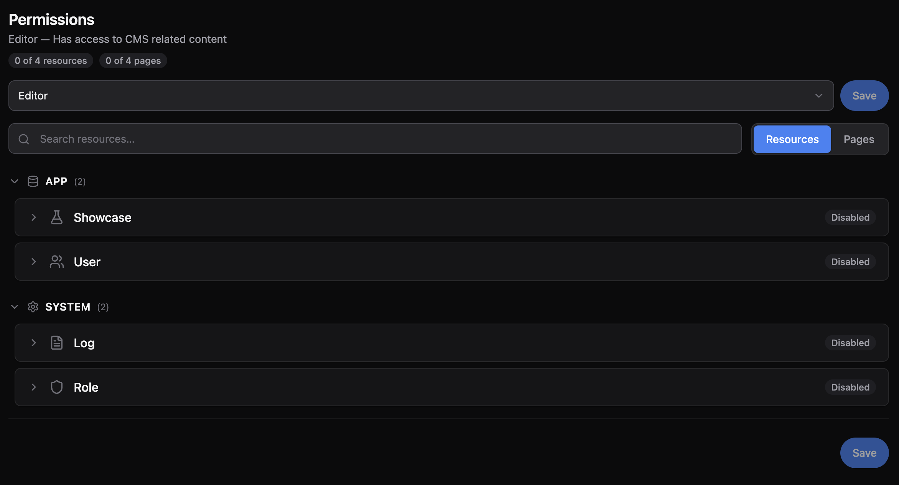

# @maxal_studio/kratosjs-plugin-permissions

Adds **role-based permissions** to a KratosJs admin panel. You get a visual
**Permissions** page where you define roles and grant each one access to resources
(actions, tabs, widgets) and pages (blocks). Works on both MongoDB and SQL.





When registered, the plugin attaches a nullable `role` **relation**
(`User` → `AdminPermissions`) to your user entity, so a user references its role by
**id**. The base KratosJs app templates no longer ship a hardcoded `role` field — the
role concept comes entirely from this plugin.

## Install

```bash
npm install @maxal_studio/kratosjs-plugin-permissions
```

> Testing against a local, unpublished build of KratosJs? See
> [Developing & Testing Plugins Locally](../../nodejs-kratosjs/docs/plugins/local-development.md).

## Register

**Server** (`src/index.ts`):

```ts
import { PermissionsPlugin } from '@maxal_studio/kratosjs-plugin-permissions';

Panel.make('admin')
	// ...
	.plugins([new PermissionsPlugin()]);
```

**Client** (`src/admin/main.tsx`):

```ts
import permissions from '@maxal_studio/kratosjs-plugin-permissions/client';

mountAdminPanel({ plugins: [permissions] });
```

After registering, open the **Permissions** page in the panel to create roles and set
their access.

The plugin attaches the `role` relation to the entity named `User` by default. If your
user entity has a different name, pass it: `new PermissionsPlugin({ userEntityName: 'Account' })`.
Make sure the user's resource is registered **before** the plugin so the entity can be found.

## Add the role field to your user resource

The plugin adds the relation to the entity but does not modify your resource — add the
**Role** select and column yourself (`src/resources/UserResource.ts`):

```ts
import { SelectInput, TextColumn } from '@maxal_studio/kratosjs';

// in form():
SelectInput.make('role').label('Role').relationship('role', 'name', 'admin-roles'),

// in table().columns():
TextColumn.make('role.name').label('Role').badge(),
```

`relationship('role', 'name', 'admin-roles')` populates the dropdown from the roles you
create on the Permissions page (slug `admin-roles`) and stores the selected role's **id**
on the user.

## Flow the role into auth

So the panel knows the logged-in user's role, return it from your auth callbacks. The
value may be an unpopulated relation — KratosJs reduces it to the role id for you
(`normalizeRoleId`), so you can return it as-is (`src/index.ts`):

```ts
new EmailAuthProvider({
  validateCredentials: async (email, password) => {
    const user = await em.findOne(User, { email });
    // ...verify...
    return { _id: String(user.id), email: user.email, role: (user as any).role };
  },
}),

getUserById: async (id) => {
  const user = await em.findOne(User, { id });
  return { id: String(user.id), email: user.email, role: (user as any).role };
},
```

## Super admins

A super admin bypasses every permission check. A role is a super admin when its id is
configured, or — by default — when its slug (`AdminPermissions.role`) is `admin`.

```ts
// By id, when known up front:
.plugins([new PermissionsPlugin({ superAdminRoleIds: [1] })]);

// Or register the id at runtime (e.g. from a seeder, once it exists):
PermissionsPlugin.markSuperAdminRole(adminRole.id);
```

Seed an admin role and link your admin user to it (`src/index.ts` start callback):

```ts
const AdminPermissions = PermissionsPlugin.getEntity();
let adminRole = await em.findOne(AdminPermissions, { role: 'admin' });
if (!adminRole) {
	adminRole = em.create(AdminPermissions, {
		role: 'admin',
		name: 'Admin',
		description: 'Full access',
		resources: {},
		pages: {},
		createdAt: new Date(),
		updatedAt: new Date(),
	});
	await em.persistAndFlush(adminRole);
}
PermissionsPlugin.markSuperAdminRole(adminRole.id);

const admin = await em.findOne(User, { email: 'admin@example.com' });
if (admin && !(admin as any).role) {
	(admin as any).role = adminRole;
	await em.flush();
}
```

> **SQL note:** the plugin's bundled migration targets MySQL/MariaDB/Postgres. On SQLite,
> start the panel with `{ migrate: false, updateSchema: true }` so the schema generator
> creates the `admin_permissions` table and the user `role` foreign key.
